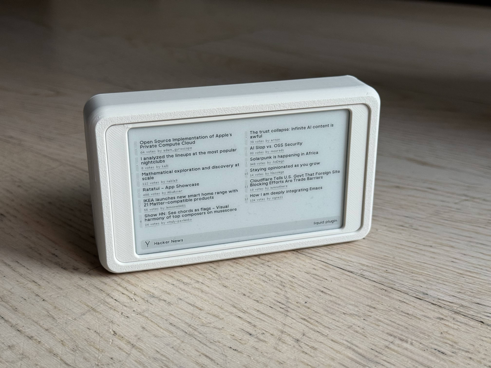
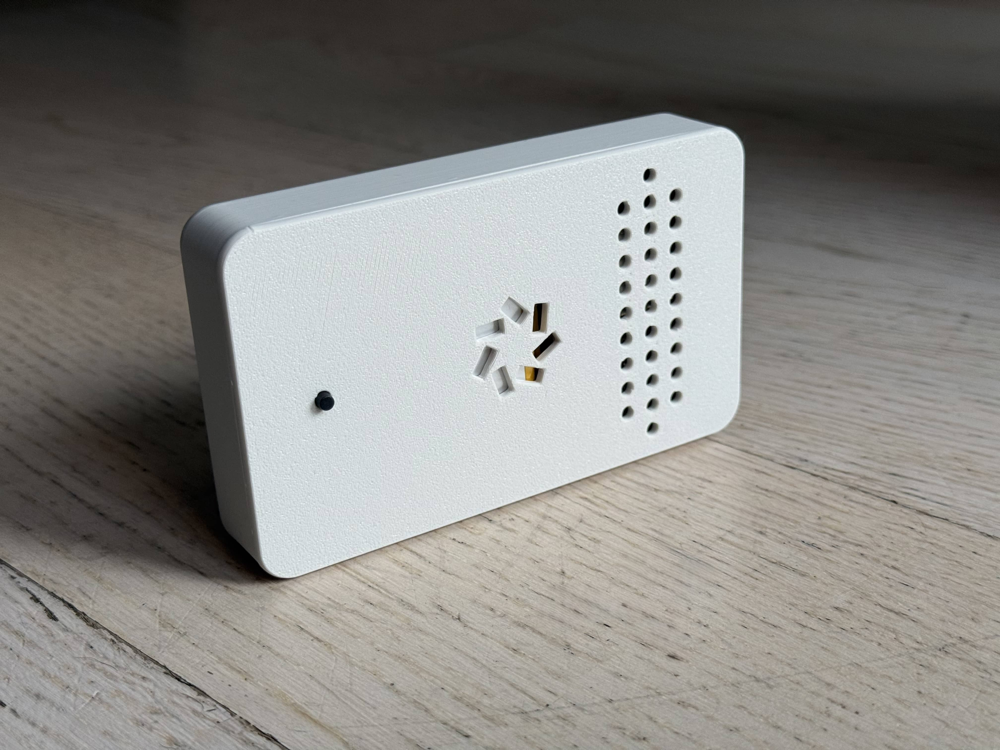
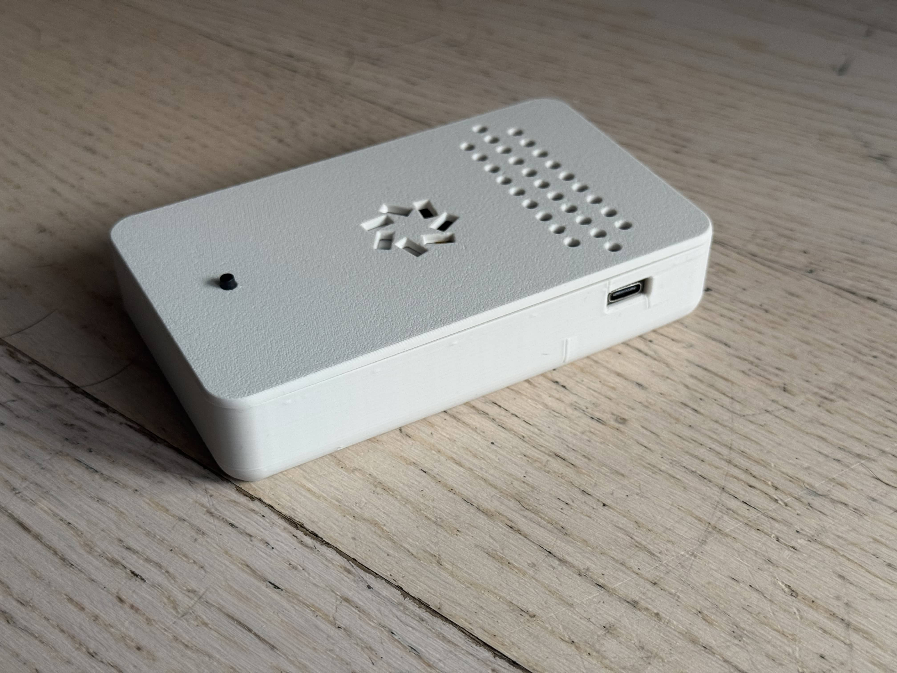
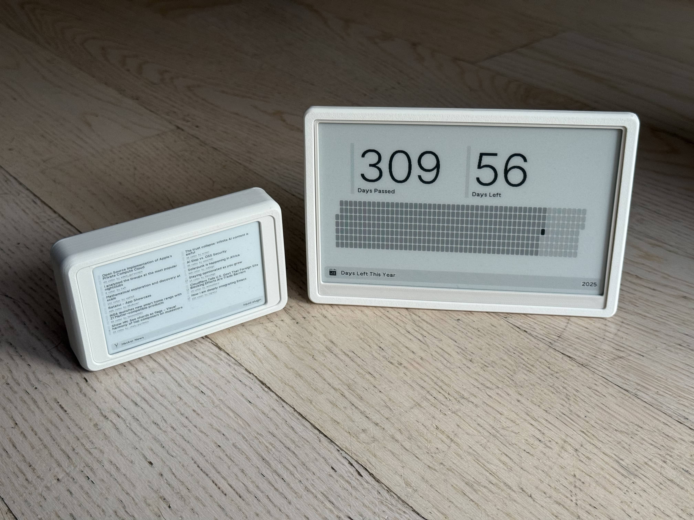
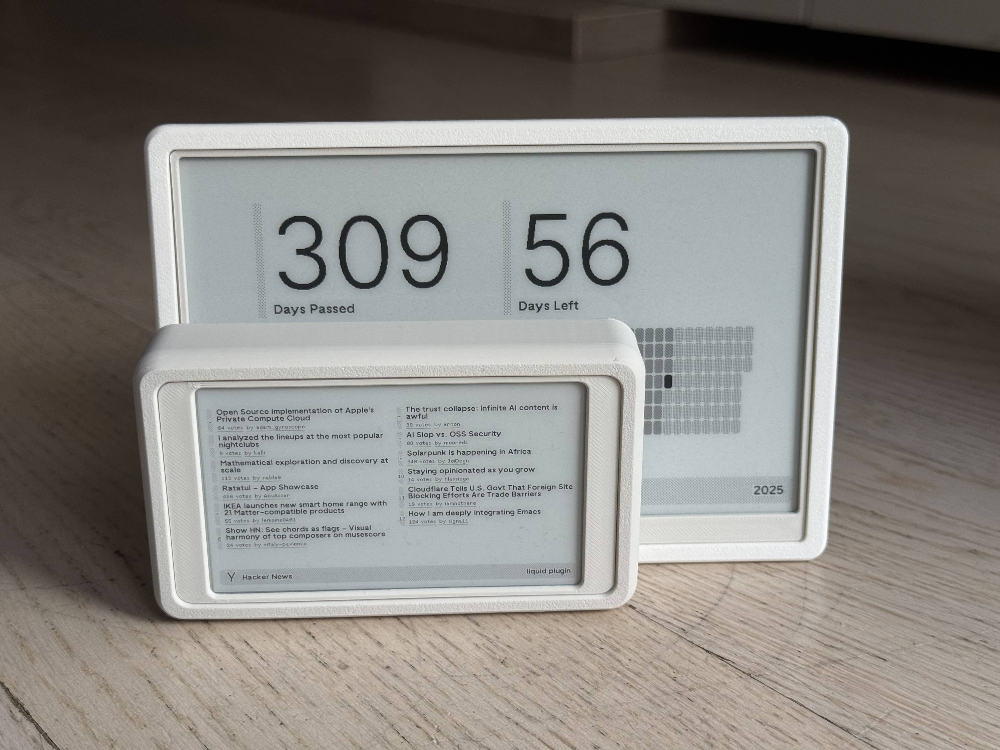
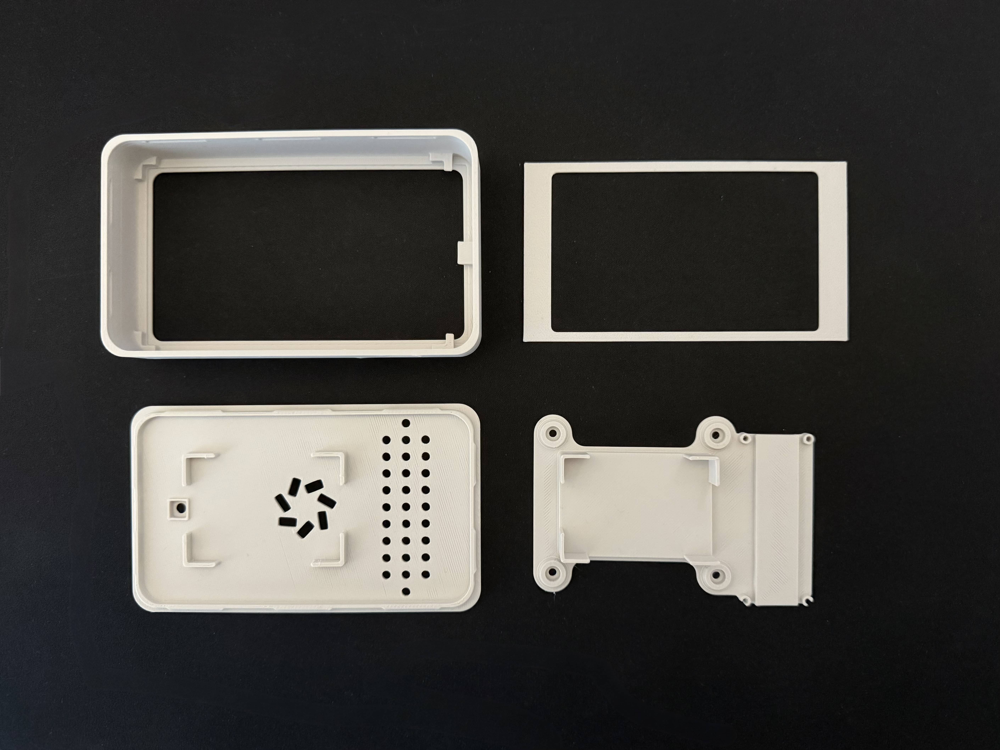
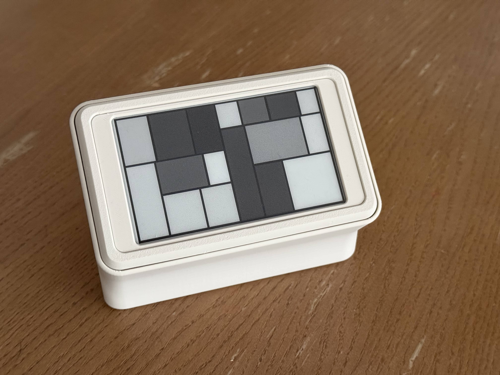
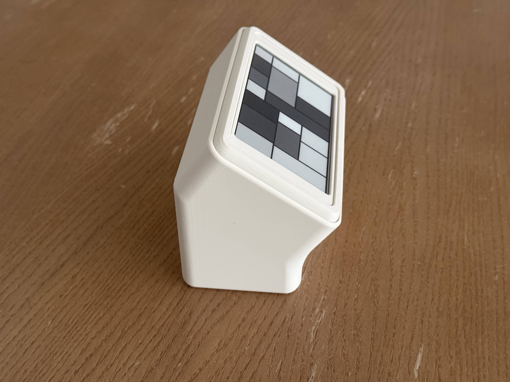
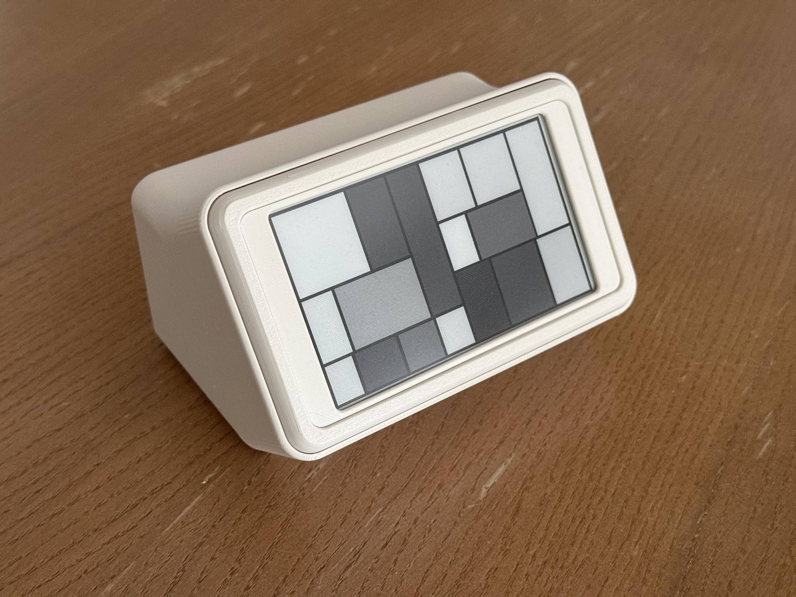
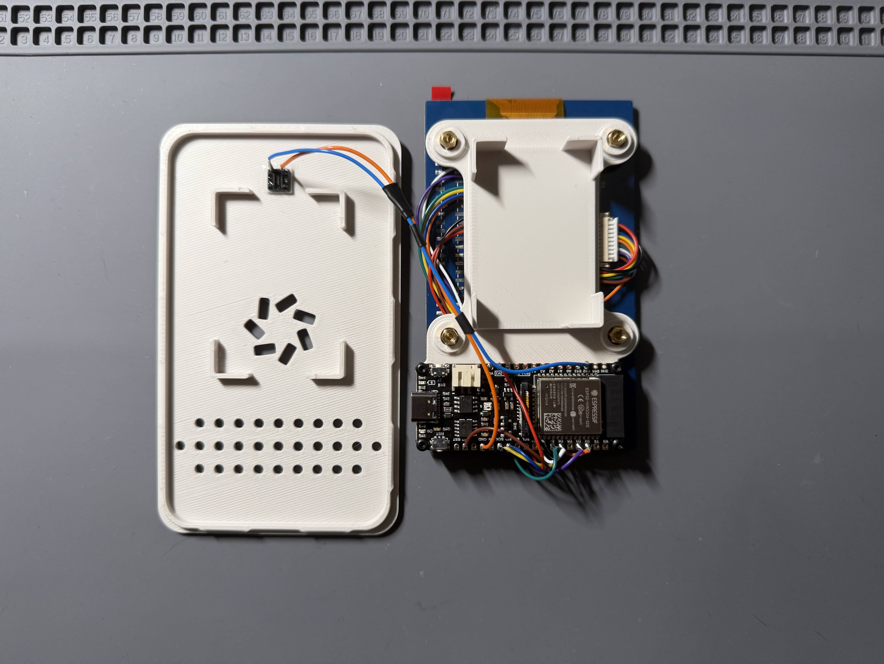

# TRMNL mini
4.26" 800x480 e-ink display long-lasting battery powered device that's fully compatible with TRMNL's [BYOD](https://docs.usetrmnl.com/go/diy/byod). In other words, TRMNL *mini*.





## Why
I wanted a smaller device that I could use to display simpler plugins/recipes that would work with TRMNL's design system.
Recently I've built myself a TRMNL (as well as purchased the BYOD license) using Seeed Xiao OG DIY KIT and I really like using it in my day-to-day.

So I thought to myself - what if I had this... but a bit smaller, to display weather and some simple stats?
I started looking for a compatible panel that would *somehow* work with TRMNL image generation. Found a 4.26" 800x480 panel from Waveshare - exact match when it comes to resolution.

It is a DIY project, so you will have to solder and assemble everything by yourself, this includes 3D printing the case.

Here is a comparison of the fully built device to a "normal sized" TRMNL (7.5") - it's a Seeed TRMNL DIY Kit in a [case that I designed](https://makerworld.com/en/models/1888836-trmnl-seeed-diy-og-kit-case):




## Firmware
This repository has a lightly edited TRMNL's firmware in `/firmware`.
Firmware is currently based on `v16.10.0`.

Changes:
- Added new ENV `[env:dfrobot_firebeetle2_esp32e]`
- Added Firebeetle 2 ESP32-3 board pin definition
- Removed static `bb_epaper` library, added a `2.0.0` version that supports the Waveshare 4.26" e-ink panel

## Requirements
- [Waveshare 4.26" 800x480 e-ink panel with HAT](https://www.waveshare.com/4.26inch-e-paper-hat.htm)
- [Firebeetle 2 ESP32-E dev board](https://wiki.dfrobot.com/FireBeetle_Board_ESP32_E_SKU_DFR0654)
- Li-Po 3.7V 2000mAh 103450 battery 
    - 50x34x10 mm - needs to have the same dimensions, otherwise you will have to modify the case
- Micro switch - 6x6x7 mm
- M2 screws + nuts
- M2.5 screws
- Access to 3D Printer

I've used the [hat](https://www.waveshare.com/4.26inch-e-paper-hat.htm) version of this display only because that was available in my country and I didn't want to wait for shipping. I ~~desoldered~~ ripped off the pads while removing the headers.  
The device could be a little slimmer if I have went with [raw panel](https://www.waveshare.com/4.26inch-e-paper.htm) + Waveshare's [Universal E-Paper Universal e-Paper Raw Panel Driver HAT](https://www.waveshare.com/e-paper-driver-hat.htm) but I wouldn't have built in mounting screw posts.

## Building the firmware
Follow the instructions in [TRMNL's firmware repo](https://github.com/usetrmnl/trmnl-firmware?tab=readme-ov-file#compilation-guide), just make sure you pick the correct env (`[env:dfrobot_firebeetle2_esp32e]`) when building and flashing it to ESP32.

## Wiring
You can change the pins in the firmware if you want, this is what I consider "default", as in "as is" in the firmware I modified.

### Screen
```sh
PIN_CLK   18   // #ffff00 SCK
PIN_DIN   23   // #1500ff MOSI

PIN_CS    25    // #ffa200
PIN_DC    13   // #00ff15
PIN_RST   14   // #ffffff
PIN_BUSY  26    // #ff00d4

VCC → 3V3
GND → GND
PWR → 3V3
```

### Button
```sh
LEG 1   4
LEG 2   GND

Additionally 10k resistor from VCC to PIN 4
```

## Case
The case was designed by me in Fusion360. I designed it in a similar style of the case I did for my [Seeed OG DIY Kit TRMNL](https://makerworld.com/en/models/1888836-trmnl-seeed-diy-og-kit-case).

I've printed the case on Bambu Lab P1S with Bambu Lab Matte PLA Bone White filament.

It has a couple of parts:
- Front
- Display ring
- Midframe
- Back



The back of the case holds the whole assembly in place.
The USB-C port of the Firebeetle 2 is accessible from underneath.

All the files for the case are in `/case`:
- `.stl`
- `.step`
- `.f3d`

There is also a `.3mf` with everything set up on plates with Bambu Studio.

I designed a stand for it as well (visible in the pictures), which angles the display nicely for desktop usage. It can be used in two different configurations.  





## Assembly
Assembly steps assume everything is soldered and you have confirmed it works.
I routed the display cable under the midframe, there is enough clearance for it.



- Insert the display ring into the front of the case
- Screw in the board into the midframe
- Screw in the midframe into the back of the display
- Put the battery in the midframe holder for it and connect it to board
- Insert the button into the back of the case.
    - I would recommend using a drop of AC glue to hold it in place.
- Insert the display with midframe into the front of the case, pop it in place
- Put the back of the case in, push it in so it snaps shut

## Final notes
I really like TRMNL devices and what the company and people behind it stand for.
They had a really great idea and executed it well.
This project wouldn't be possible if they didn't open source their firmware.
